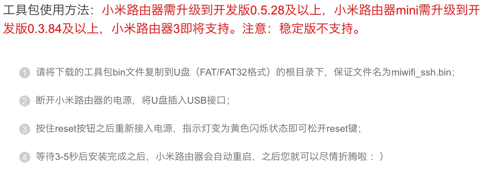
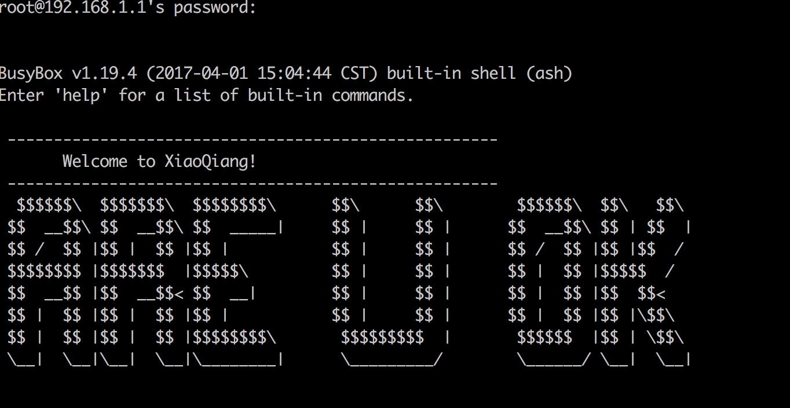
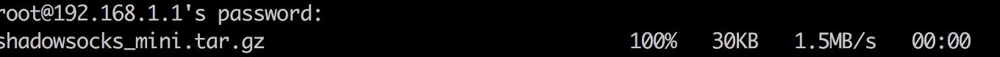
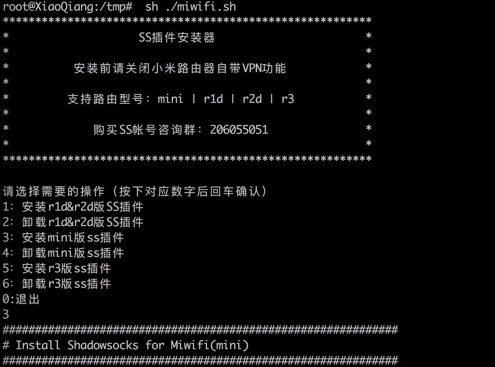
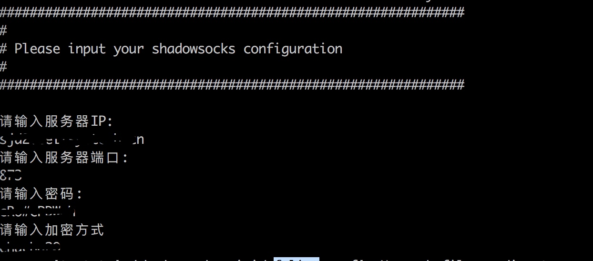
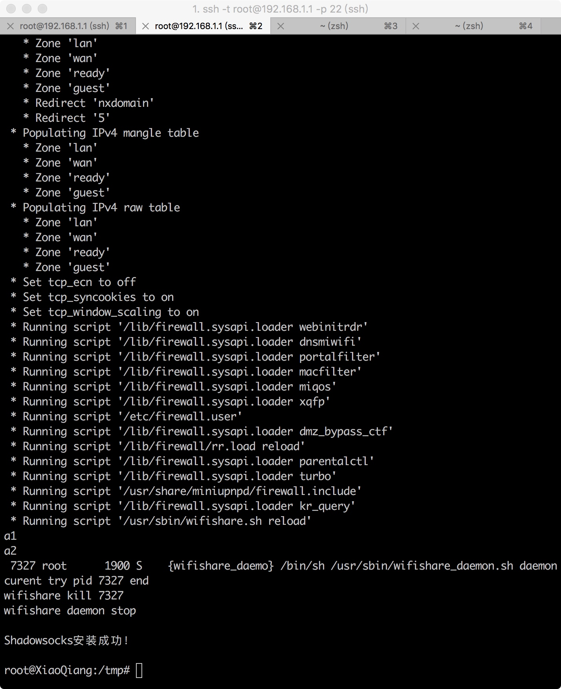

# 开启小米路由器shadowsocks （Mini）

```
看看外面的世界
```

## 开启ssh
```
需要先将账号与路由器绑定
```
[详细开启步骤](https://d.miwifi.com/rom/ssh?userId=173867535)



## 通过终端链接路由器

```
    ssh -t root@192.168.1.1 -p 22
```

* 其中root不能修改
* ip为访问路由器后台管理界面地址（默认为192.168.31.1）
* -p 22 可以不添加

> 连接路由器 需要的密码通过 `http://www1.miwifi.com/` 绑定后获取
> 密码输入过程无显示，输入完成后直接回车即可


> 连接路由器成功信息



## 复制文件到路由器
> 
**以下文件已被修改，请一定要使用我所提供的文件**
> 需要复制三个文件到 路由器 /tmp 目录下

* miwifi.sh 可以没有，如果是新手，最好拷贝
* mini_ss.sh 目录是下载shadowsocks_mini.tar.gz/解压/添加ss配置信息
* shadowsocks_mini.tar.gz 路由器ss工具

1. 复制mini.sh 文件到 /tmp 目录
    
    ```
    scp Desktop/miwifi.sh root@192.168.1.1:/tmp
    ```
2. 复制mini_ss.sh文件到 /tmp 目录
    
    ```
    scp Desktop/mini_ss.sh root@192.168.1.1:/tmp
    ```
3. 复制shadowsocks_mini.tar.gz 到/tmp 目录
    
    ```
    scp Desktop/shadowsocks_mini.tar.gz root@192.168.1.1:/tmp
    ```
    > 复制成功信息展示
    
    


## 执行配置
> 运行脚本文件
> ./miwifi.sh 即可
> 选择对应的设备代号



> 配置ss服务器信息，可以找免费的，也可以自己去买



## 安装完成

> 配置完成信息后自动安装，安装成功信息显示



## 附件下载
> 在我的github主页找即可

## 后记

* 有任何问题可以发送邮件到(wangxj0714@163.com)


